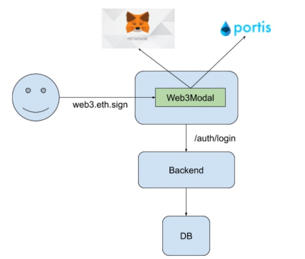

# Web3-Ethereum-fullstack-application

**A Web3 Ethereum fullstack application test task**

# Test Task Requirement

## Overview

Web3 is the entrance for users entering the magic of Ethereum network. Web3Modal is a ReactJS component that simplifies the integration of web3 experience. It supports multiple popular web3 providers.

In this test task you are expected to create a fullstack application that authenticates the user through web3 (using Web3Modal). The authentication should be performed through the web3.eth.sign with a timestamp included in the signing message, while the backendshould use the fromRpcSig and ecrecover from ethereumjs-utils to validate the message then authenticate the user.

## System View

The system should look like:

## Technical Requirements

1. The frontend should be a single page application written in ReactJS.
2. The design and UX of the front should be given some love and thought.
3. The backend should be written in NodeJS, with plain expressjs or with frameworks such as feathers.js, sailsjs, or hapi.
4. The database can be in either mysql or any nosql.
5. Users shall be able to use at least metamask and portis as login options through Web3Modal.
6. Backend should implement auth.login which validates the signed message from users.
7. After successful authentication, a user object should be stored in the database with the user's ethereum address stored.
8. After successful authentication, The frontend should show a visual representation of users ETH balance, and balance of DAI token. Please be creative with the page design. You may also add typical web3 features such as deposit and send tokens.
9. (Optionally) Browser sessions implemented as cookies, jwt token stored in localstorage or other ways.

---

# Implement

## Configuration:

1. Open the ganache client
2. Configure mysql(the directory path is: .\node_modules\dao\ dbConnect.js), configure *"host"*, *"user"*, *"password"*, *"database"*(i.e. database name) fields, and then create a table in mysql after configuration, add three fields *"username"*, *"password"*, *"chainadd"*

## Operation Process:

1. Enter the project root directory .\node_modules\dao\ dbConnect.js 
2. *npm start*, to start database
3. Open another termina to start web3.js, go into the directory .\qb
4. *truffle compile*, to compile smart contracts
5. *truffle migrate*, to deploy smart contracts
6. *npm run dev*, to start the project
